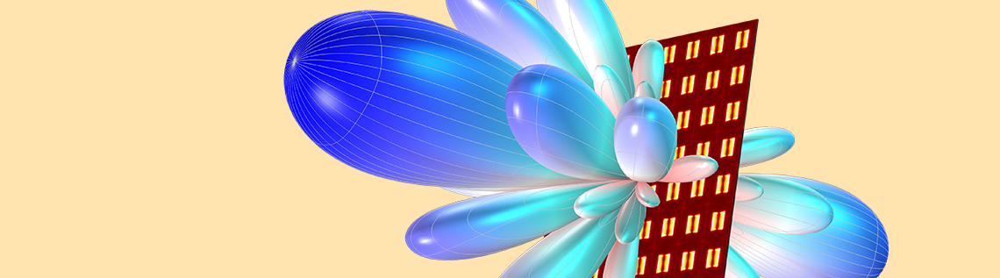

# Microphone Arrays and Spatial Processing

## Instructor: Prof. Sharnog Gannot

### Course Topics

1. **Microphone Arrays and Spatial Definitions:**
   - Narrowband Signals
   - Near-field and Far-field
   - Array Manifold Vector
   - Beamforming

2. **Uniform Linear Arrays (ULA):**
   - Radiation Patterns
   - Performance Criteria for Arrays:
     - Beamwidth
     - Sidelobe Level
     - Directivity
     - White Noise Gain
   - Array Sensitivity to Errors
   - Sampling of a Continuous Aperture
   - Extension to Wideband Signals and Nested Arrays

3. **Space-Time Random Processes:**
   - Sample Vectors (Snapshots)
   - Spatial Correlation Matrix
   - Signal Subspace and Noise Subspace

4. **Optimal Beamformers:**
   - MVDR (Capon)
   - MPDR
   - Maximum SNR
   - MMSE
   - LCMV

5. **Adaptive Spatial Processing:**
   - Frost’s Method
   - Implementation in Generalized Sidelobe Canceler (GSC) Configuration

6. **Sensitivity and Robustness Improvement:**
   - Super-directive Beamformer
   - White Noise Gain
   - Robustness Enhancement by Diagonal Loading

7. **Spatial Parameter Estimation (Direction of Arrival - DoA):**
   - Maximum Likelihood (ML) Estimation
   - Estimation Accuracy
   - Cramér-Rao Bound
   - Estimating the Direction of Multiple Sources
   - Expectation-Maximization (EM) Algorithm

8. **Source Localization:**
   - Classical Methods (Bartlett)
   - Eigenvalue Decomposition Methods (Pisarenko, MUSIC, ESPRIT)
   - Estimation by MVDR
   - Performance Comparison and Resolution
  

Please let me know if you have any questions, feel free to contact me!
